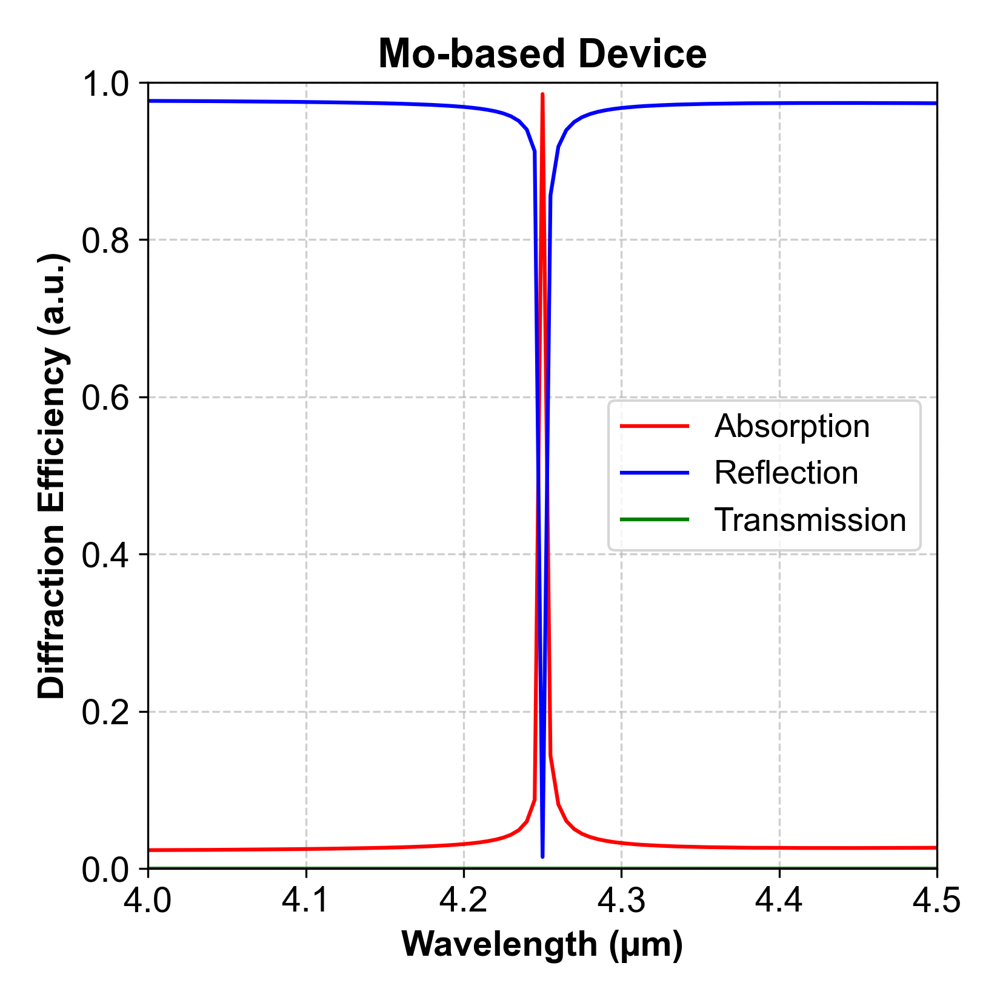

# Diffract_Plot

This script quickly plots diffraction efficiency data (Reflection, Transmission, Absorption) from **RSOFT DiffractMOD** output files. It allows flexible column selection and customization of plot appearance.



## Features
- Supports **Reflection (R), Transmission (T), Absorption (A)**.  
- Allows **column selection** using short (`r, t, a`) or full names (`reflection, transmission, absorption`).  
- Customizable **x/y axis limits** and **plot title**.  
- Automatically saves the plot as a `.png` file.


# Usage
```bash
python diffract_plot.py -f dftmp.dat [OPTIONS]
```

# Arguments

| Argument       | Description                                      | Example                        |
|---------------|--------------------------------------------------|--------------------------------|
| `-f, --filename` | Input data file (**required**)              | `-f data.txt`                  |
| `--columns`   | Columns to plot (`r,t,a` or full names)         | `--columns=r,a`                |
| `--xmin`      | Minimum x-axis value                            | `--xmin 0.5`                   |
| `--xmax`      | Maximum x-axis value                            | `--xmax 2.0`                   |
| `--ymin`      | Minimum y-axis value                            | `--ymin 0.0`                   |
| `--ymax`      | Maximum y-axis value                            | `--ymax 1.0`                   |
| `--title`     | Plot title (optional)                           | `--title "My Plot"`            |


# Examples
- Plot all columns (default behavior)
```bash
python diffract_plot.py -f data.txt
```

- Plot only Reflection & Absorption
```bash
python diffract_plot.py -f data.txt --columns=r,a
```

- Set custom axis limits & title
```bash
python diffract_plot.py -f data.txt --xmin 0.5 --xmax 2.0 --ymin 0.1 --ymax 0.9 --title "Efficiency Spectrum of Ag-based device"
```

# Output
The script saves the figure as <input_filename>_plot.png in the same directory.
